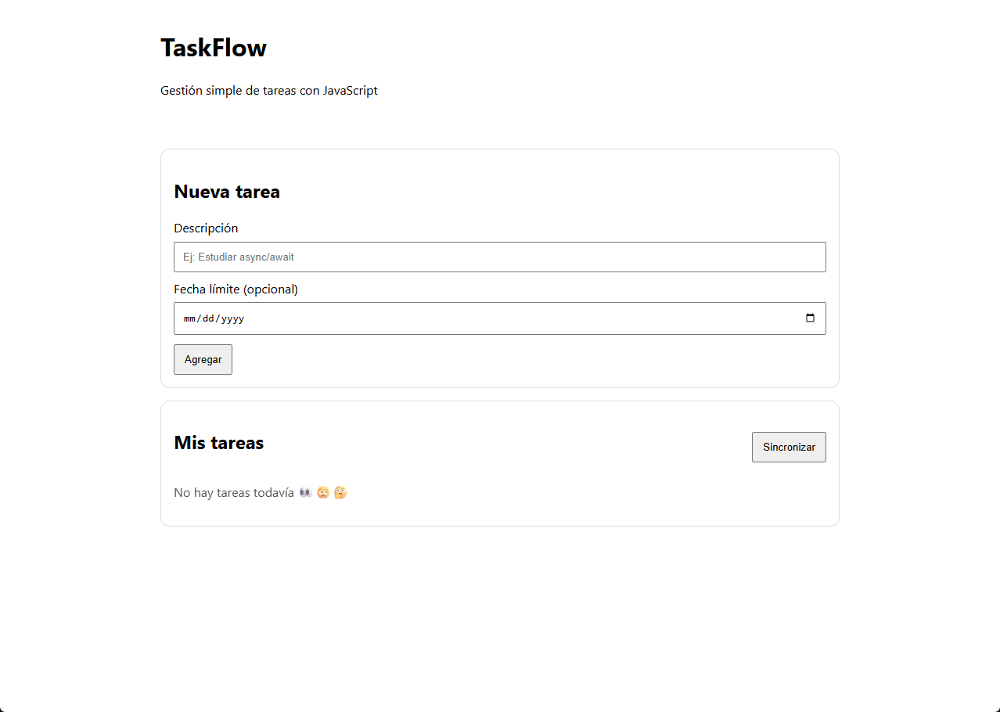
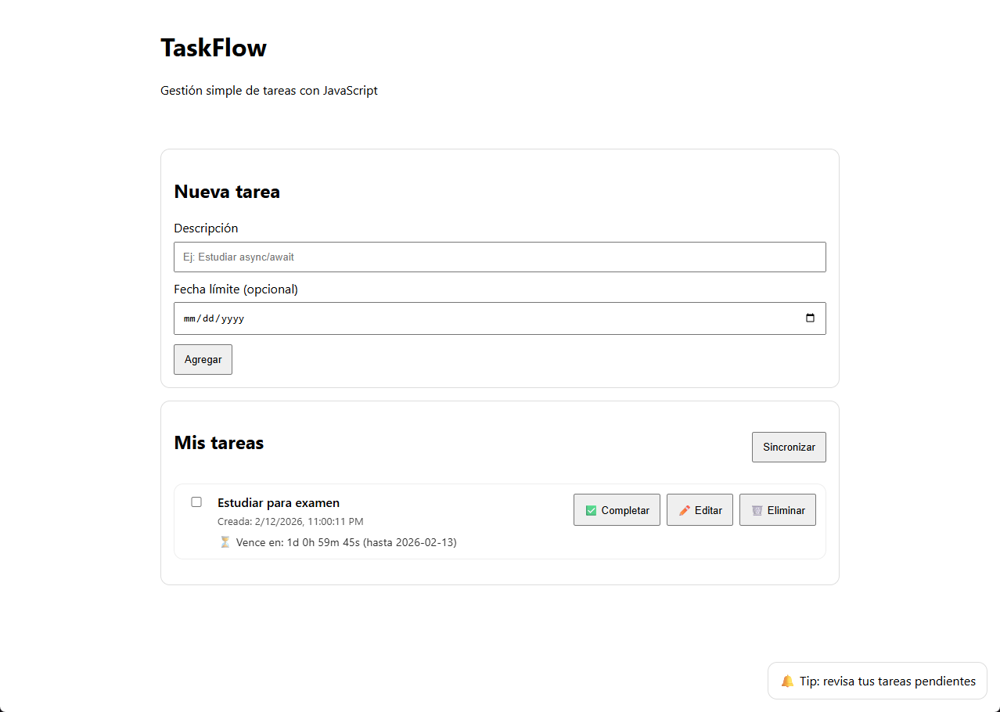
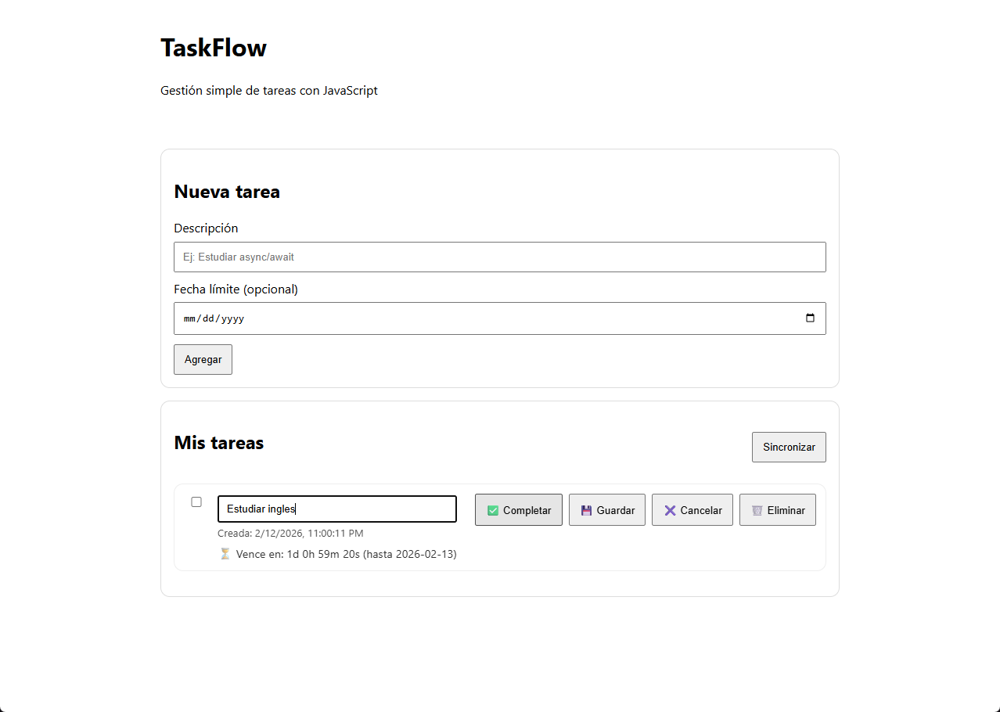
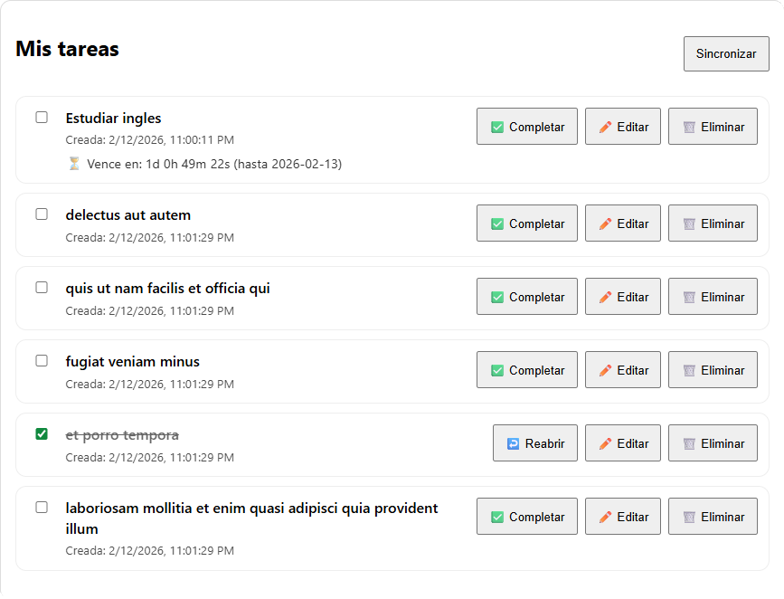

📌 TaskFlow – Aplicación Web de Gestión de Tareas (Módulo 4)

Proyecto desarrollado para el Módulo 4 – Programación Avanzada en JavaScript, cuyo objetivo es aplicar conceptos intermedios y avanzados del lenguaje mediante una aplicación web interactiva, enfocada en la manipulación del DOM, programación asíncrona y consumo de APIs.

🎯 Objetivo del proyecto

Desarrollar una aplicación web en JavaScript que permita gestionar tareas, aplicando:

Programación Orientada a Objetos (POO)

Manipulación del DOM y manejo de eventos

Características modernas de JavaScript (ES6+)

Programación asíncrona (async / await)

Consumo de APIs externas

Persistencia de datos en el navegador

⚙️ Funcionalidades

La aplicación permite al usuario:

Crear tareas con descripción y fecha límite opcional

Editar tareas existentes

Eliminar tareas

Marcar tareas como completadas y reabrirlas

Visualizar un contador regresivo en tareas con fecha límite

Mantener las tareas guardadas aunque se recargue o cierre la página

Importar tareas desde una API externa mediante el botón Sincronizar

Recibir mensajes visuales de confirmación y notificación

🖥️ Ejecución del proyecto

Abrir el proyecto en Visual Studio Code

Ejecutar index.html (recomendado con Live Server)

Interactuar con la aplicación desde el navegador

Las tareas se gestionan directamente desde la interfaz gráfica

🧠 Conceptos aplicados

Uso de clases para estructurar la lógica (Tarea, GestorTareas)

Separación de responsabilidades por carpetas (modelos, servicios, UI)

Manipulación dinámica del DOM

Delegación de eventos para mejorar el rendimiento

Programación asíncrona con fetch, async / await y try / catch

Uso de setTimeout y setInterval para simulación de procesos asíncronos

Persistencia de datos usando localStorage

Consumo y normalización de datos desde una API externa

Control de versiones con Git y GitHub usando ramas de trabajo

📂 Estructura del proyecto
TaskFlow/
├── index.html
├── css/
│   └── styles.css
├── js/
│   ├── main.js
│   ├── models/
│   │   ├── Tarea.js
│   │   └── GestorTareas.js
│   ├── services/
│   │   ├── api.js
│   │   └── storage.js
│   └── ui/
│       └── dom.js
└── README.md

👤 Autor

Antonio Toro Sagredo
Curso: Desarrollo de Aplicaciones Full Stack JavaScript Trainee
Módulo 4 – Programación Avanzada en JavaScript

## 📸 Capturas de la aplicación en funcionamiento

### Portada

### Crear tarea

### Editar tarea

### Sincronizar API
